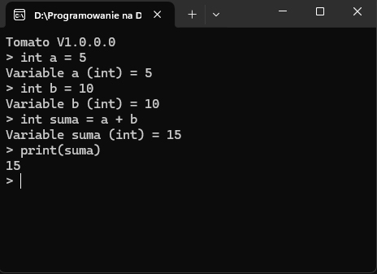
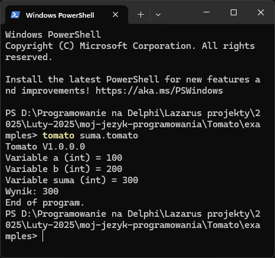
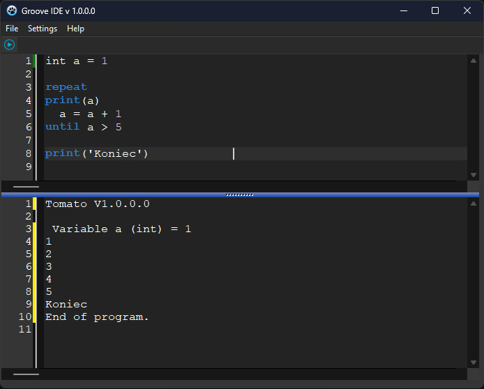

# Tomato
Tomato - interpreter

# Co to jest Tomato?

## Tomato został zaprojektowany jako odpowiedź na skomplikowane składnie i powolny proces kompilacji. Jako **język interpretowany**, kod Tomato jest wykonywany linia po linii, co sprawia, że idealnie nadaje się do szybkiego prototypowania, skryptów automatyzujących i nauki programowania. Jego składnia jest czysta, czytelna i inspirowana naturą – prosta jak krojenie pomidora.

# [Oficjalna strona:]( https://tomato.dimitalart.pl/)
# [Dokumentacja:](https://tomato.dimitalart.pl/dokumentacja.html)

# [Pobierz tomato](https://sourceforge.net/projects/tomato-programming-language/)

# Repl mode

# Script mode
## Umieść plik tomato exe na przykład na dysku C:\tomato
## Dodaj ścieżkę do zmiennych systemowych w path -> edytuj path -> nowa -> wklej ściężkę do tomato wraz z nazwą tomato.exe 

## Powinno być tak C:\tomato\tomato.exe
# Script mode

## Tomato kod w IDE Groove
# [Pobierz Groove IDE](https://sourceforge.net/projects/groove-ide/)

